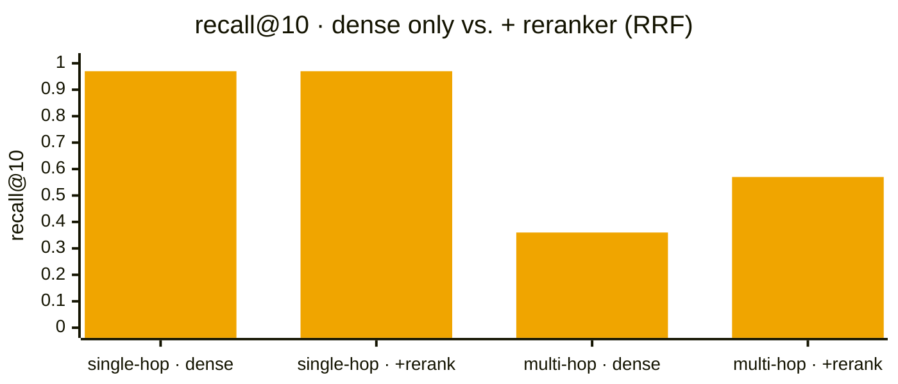
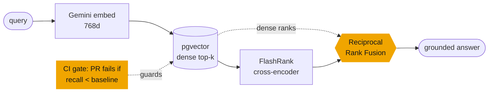
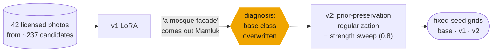

<p align="center">
  
</p>

<p align="center">
  <a href="https://www.amr-mohammed.com"></a>
  <a href="https://www.amr-mohammed.com/Amr_Mohammed_ML_Engineer_Resume.pdf"></a>
  <a href="https://www.linkedin.com/in/amr-mohammed01"></a>
  <a href="mailto:amrm88289@gmail.com"></a>
</p>

<p align="center"><b>I build LLM, agent, and vision systems, and I measure them before I claim anything.</b><br>
When something breaks, I go back to the fundamentals to find out <i>why</i>. Three examples below.</p>

---

### `$ cat now.log`

```diff
+ ML Engineer (part-time, remote) @ GETnFORM                      Sep 2026 → now
    architecting a confidential client's on-prem image-generation platform:
    async GPU job queue · swappable inference engines · LoRA registry
    confidentiality forced self-hosting; my break-even analysis priced it
    (fal is cheaper below ~10–20k images/month) and sized the hardware (48 GB VRAM)
    training Flux LoRAs with fixed-seed evals for style accuracy, hallucination, bleeding

+ AI Intern @ Al Amalka Securities (EGX brokerage)                  Aug 2026 → now
    offline Egyptian national-ID extractor: OpenCV + 2× YOLO + PaddleOCR (Arabic)
    84/84 front fields correct on the test set, every field confidence-tagged
    extended to KSA passports (MRZ + VLM) and birth certificates
    live OCR of the MIST trade feed → feeds an EGX forecasting pipeline

! open to full-time ML Engineer / AI Engineer roles · remote or Cairo
```

---

## `01` DocuMind: the retrieval miss that wasn't a retrieval miss

> **[live demo](https://documind.amr-mohammed.com)** · **[case study](https://www.amr-mohammed.com/documind)** · **[source](https://github.com/AmrMohamed17/Documind)**

I built the evaluation first: a hand-written, programmatically validated **100-question golden set** and a three-metric harness. Multi-hop recall came back weak. I traced every miss back to the database and found the right passage **was** being retrieved, just ranked below the cutoff. That made it a *ranking* problem, not a *coverage* problem. So the fix was a cross-encoder reranker fused with the dense ranks, not a bigger index.





| | result |
| --- | --- |
| single-hop recall@10 | **0.97**, held flat through reranking |
| multi-hop recall@10 | **0.36 → 0.57** |
| unanswerable questions | refusal held on **all 15** cases |
| answer faithfulness | **4.82/5** mean (LLM-as-judge, spot-checked, used directionally) |
| hybrid BM25 search | **built, measured, deleted**: ≤0.01 recall change, as the ranking diagnosis predicted |

---

## `02` Mamluk LoRA: a style leak is a regularization problem

> **[model + eval grids](https://huggingface.co/Amr292/mmlkcairo-sdxl-lora)** · **[dataset](https://huggingface.co/datasets/Amr292/mamluk-cairo-style-dataset)** · built in one day · the project that got me my GenAI role

An SDXL LoRA for Cairo's Mamluk architecture. v1 learned the style, and then a plain *"a mosque facade"* prompt, with no trigger word, also came out Mamluk. The LoRA had overwritten the **base class**, not just learned a new concept.



Prior preservation trains on generic class images alongside the style images, so the model keeps its prior for "mosque" and binds the new style to the trigger token only. Remaining limitations are documented in the model card.

---

## `03` OSS Contribution Copilot: I audited the ground truth before trusting it

> **[case study](https://www.amr-mohammed.com/oss-copilot)** · **[source](https://github.com/AmrMohamed17/oss-copilot)** · **[MCP server on PyPI](https://pypi.org/project/oss-issues-mcp/)** · listed in the official MCP Registry

A supervised multi-agent system (in progress) that finds claimable open-source issues and drafts a human-approved claim comment. GitHub labels looked like free, expert-labelled training data. So before writing any agent code, I checked who actually applies them, across **2,568 issues** in five ecosystems:

<p align="center"></p>

Most of the "expert answer key" was self-reports, generated by issue templates. The label classifier was demoted to a fallback, and ground truth moved to labels applied after a human read the issue. I also caught and removed a **39.3-point authorship confound** in my own calibration set. The shipped piece is **[oss-issues-mcp](https://github.com/AmrMohamed17/oss-issues-mcp)**: derived triage tools rather than a GitHub passthrough, a repo allowlist, and write access off by default.

---

## More I've shipped

| | what it shows | stack |
| --- | --- | --- |
| 📨 **[Reactivation Agent](https://github.com/AmrMohamed17/Reactivation-Agent)** · [live](https://reactivation-agent-one.vercel.app) | LLM pipeline with a separate **grounding verifier** that flags unsupported claims; the send endpoint refuses anything a human hasn't approved | Next.js · Supabase · Resend |
| 📈 **[egx-ocr](https://github.com/AmrMohamed17/egx-ocr)** | Live OCR of a trading app. The documented finding: the window repaints in jumps during bursts, so coverage (~90–95%) is capped by the data source, not the OCR | EasyOCR · PyTorch · threading |
| 🎁 **[la7za](https://github.com/AmrMohamed17/la7za)** · [live](https://la7za.vercel.app) | Arabic-first gift-page platform, built solo, live with real payments, fully RTL | Next.js · TypeScript · Supabase · Paddle |
| 🔎 **[Local Product Finder](https://github.com/AmrMohamed17/Local-Product-Finder)** | Graduation project (**A+**): real-time product recognition + hybrid recommender in a mobile app | MobileNet · Sentence-BERT · LightFM |

---

## Toolbox

<p align="center">
  
</p>

<p align="center">
  <b>LLM &amp; agents</b> RAG · pgvector · reranking · LLM-as-judge · LangGraph · MCP<br>
  <b>GenAI &amp; vision</b> LoRA (SDXL, Flux) · dataset curation · PaddleOCR · EasyOCR · YOLO · OpenCV · VLMs
</p>

---

<p align="center">
  <picture>
    <source media="(prefers-color-scheme: dark)" srcset="https://raw.githubusercontent.com/AmrMohamed17/AmrMohamed17/output/snake-dark.svg">
    
  </picture>
</p>

<p align="center"><sub>measured, then shipped · <a href="https://www.amr-mohammed.com">amr-mohammed.com</a></sub></p>
